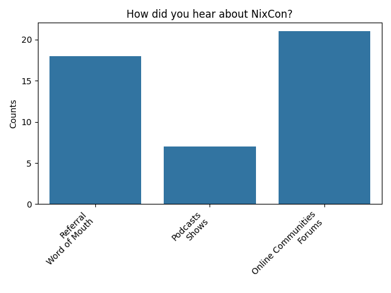
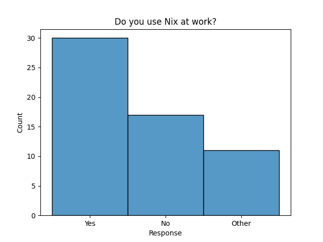
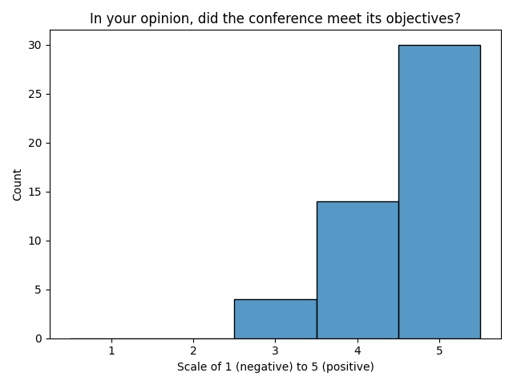
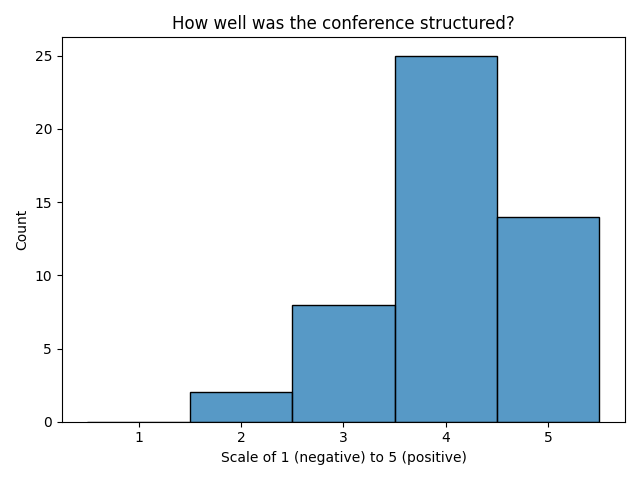
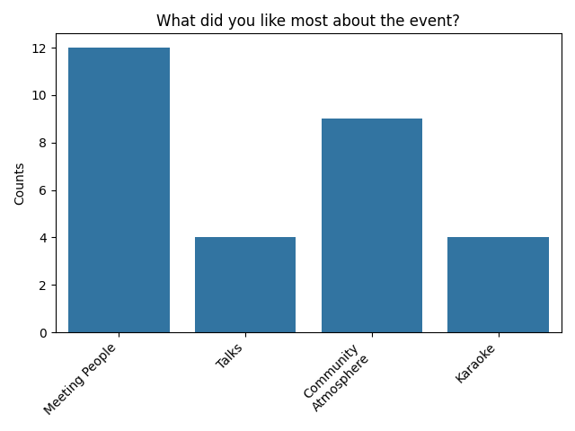
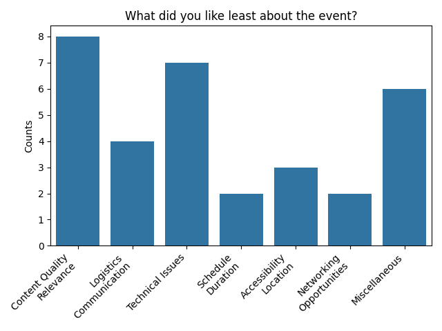

# NixCon NA 2024 Survey Results

Thanks to every that attended NixCon NA 2024 in Pasadena, CA!
And an additional big thanks to everyone that filled out the survey.

tl;dr

- We had 306 people show up at the event.
- We received 48 full responses and 30 incomplete responses for the survey.
- The overall response from the event was incredibly positive.
- Also some really wonderful constructive feedback that we will use to make future events better.

Note: For many questions, the answer was not restrict to a set of choices but was free form.
For those questions, the results were either grouped into categories and plotted or presented as responses in a table.

## Conference Attendance

For how attendees heard about NixCon, we found 3 primary categories:

- Referral through word of mouth
  - Most of these responses appear to be directly from talking with other people or hearing about the event through their social media
  - 2 responses were from the SoCal Nix Users Group as well as 2 responses from SCaLE.
- Podcasts/Shows
  - Jupiter Broadcasting and Linux Unplugged were the dominant sources in this category along with a single response from Stove.
- Online Communities/Forums
  - These responses were primarily a mix of the NixOS Discourse, Matrix, and Discord.

For why attendees wanted to attend NixCon, we found 3 primary categories:

- They love nix and think it is amazing! How wonderful! <3
- They wanted to learn more about Nix and in some cases specifically learn by talking with other users.
One additional response mentioned wanted to be present for the first NixCon in North America.
- They wanted to meet, talk, and interact with other Nix users and their fellow contributors.
Some also wanted to look for Nix related jobs.

## Nix Knowledge and Usage

An overwhelming majority of the survey respondents have used Nix before.
However a non-insignificant number of people have not.
Based on our reading of the raw data, some of these people may have just heard about Nix recently and some may have wondered in from SCaLE.

A comparison heatmap of how the respondent rates their skill level with Nix versus how many years they have been using Nix.
It would appear that it takes on average 2 years for users to become proficient with Nix, as indicated by the change from Beginner to Intermediate.
This tracks with some community knowledge.
Let's work together to push this entire graph to the left!

## Conference Evaluation

Overall, people seemed satisfied with how the conference went, how it was structured, and the variety of topics presented.

## Attendee Satisfaction

Overall, people seemed satisfied with their experience at the event, opportunities provided, ease of finding information, and would recommend the event to a friend.

## Event Specifics

No surprise that Xe's talk about Nix and Docker was a hit!
The 2nd most popular talk with the State of the Union.
It is wonderful to see that people are interested in organizational and community dynamics.

I am delighted to see all our talks got some love.
Thanks again to all our wonderful speakers who came and presented!

When asked about what attendees liked the most about the event the responses is overwhelmingly a combination of meeting and talking with people and the vibes.
It is wonderful to see that people enjoyed interacting with other Nix users and enjoyed the community atmosphere.

Also, shout out to the people who organized karaoke. It was a hit!

As it was our first conference, there were definitely some issues.
Thank you all for your candid and honest feedback about how we can improve things.

- Content
  - We definitely had a lot of beginner friendly talks.
  This was intentional as it was the first large event being held in North America and because it was co-located with SCaLE.
  However, a lot of the respondents in this category wanted more intermediate and advanced talks.
- Logistics/Communications
  - We had a schedule slip on the first day due to technical difficulties.
  It was difficult to convey that to all the attendees but we will be mindful of such an issue in the future.
  - We were not as organized as we could have been.
  Because we had to rush when organizing this conference, we did not have time to sit down and clearly establish roles for all of our volunteers.
  We felt this immediately after the conference was over.
  Shortly after the conference, we had a meeting and this came up.
  We have already begun establishing roles and responsibilities so we are more organized in the future.
- Technical
  - There were most certainly technical issues that were completely out of our control.
    - The HDMI cable connected to the projector was bad. Fortunately we were able to find a cable long enough in short time and get going.
    - GitHub began rate limiting the entire conference. This was completely out of our hands and something SCaLE had never experienced before. The SCaLE Network team is already thinking of ways to combat this in years to come.
- Schedule/Duration
  - People wanted more NixCon. Don't we all!

## Future Event Improvements

Attendees were asked what we could do to improve future events.
There is too much nuance and detail in these responses to distill it down to a chart.
Rather each answer is nominally categorized but otherwise untouched.

### Content Organization and Clarity

- Offer talks targeted at different skill levels.
- Clearly indicate the difficulty level of each talk in the program.
- Provide a separate track for beginners and advanced attendees.
- Turn introductory talks into workshops for more hands-on learning opportunities.
- Offer workshops on specific topics like packing modules and writing Nix configs.
- Implement standardized scheduling to streamline the event flow.

### Technical Infrastructure and Communication

- Coordinate with GitHub to prevent build issues due to API rate limiting.
- Establish a local binary cache from the beginning.
- Communicate schedule changes promptly.
- Provide a persistent communication platform/forum for attendees.

### Logistics and Resources

- Ensure an adequate supply of HDMI cables.
- Consider extending the event duration to allow more time for networking.
- Provide larger rooms for talks and workshops.
- Have more advertising to attract attendees.

### Community Engagement and Development

- Facilitate smaller group breakouts during workshops.
- Set up collaborative development sessions.
- Establish an information booth for newcomers to learn about community involvement.
- Structure media interactions to highlight community members and contributors.

### Entertainment and Social Interaction

- Incorporate more hype talks at the beginning of the event.
- Arrange after-hours events for closer networking opportunities.
- Encourage karaoke participation for more social interaction.

### General Positive Feedback

- Continue co-locating with SCaLE unless there are compelling reasons not to.
- Maintain the current event format as it was well-received overall.

Based on the responses provided, we can group the topics for future conferences as follows:

## Future Event Topics

Attendees were asked what kind of topics would they like to see in the future.
There is too much nuance and detail in these responses to distill it down to a chart.
Rather each answer is nominally categorized but otherwise untouched.

### Beginner and Advanced Topics:

- A "beginner room" and an "advanced room"
- More intro/intermediate talks
- Intermediate/advanced workshops, any non-beginner interactive stuff
- Onboarding tracks for beginners
- A place where beginners can congregate and ask questions freely

### Nix-related Topics:

- Using Nix as a build tool to replace the likes of Make or Bazel
- Workshop for building and compiling software with Nix
- Nix in production/stories of when things went awry
- Overviews of more esoteric or newer features in Nix
- Managing Nix at scale (1000’s of nodes)
- More real world use cases and stories about Nix
- More advanced Nix stuff and cool things you can do with Nix like nixos-tests
- Nix internals
- NixOS Integration test framework
- Deep dives on developing with Nix, such as using the new debugger or `builtins.withErrorContext`
- Deep dive into flakes
- Managing a fleet of NixOS in production
- Migrating to Nix
- More 3rd party projects and self-hosting with Nix

### Advanced Topics and Experiences:

- More advanced topics/experimental stuff like recursive Nix and content-addressed derivations
- Advanced packaging scenarios or language features/idioms that have to be used
- More advanced topics, not necessarily niche, but with solutions and explanations
- More advanced topics in the future, sharing tribal knowledge, new features, big plans, etc.
- Some more crazy advanced stuff and industrial stories
- More security-focused and best practices discussions
- More unusual stuff you can do with Nix, security-focused discussions
- Real world experience reports

### Specific Technology or Language Topics:

- Asahi Linux and SELinux
- Application/language specific deep dives, e.g., ML stack, Golang

### Miscellaneous:

- Many of the same topics, especially interested in novel, technically challenging work
- Lightning talks were fun, exploring how people use Nix at work, pain points, and highlights
- Insight from the docs team, workshops on secrets management, and in-depth packaging tutorials
- Any topics that people are passionate about talking on with respect to the convention
- Talks that serve as an introduction of a project to potential new contributors
- Talks exploring the internals of an ecosystem tool in a friendly and approachable way for intermediate users
